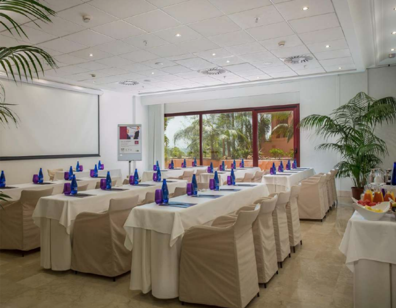

<script> 
    $(document).ready(function() { 
    $head = $('#header'); 
    $head.prepend('<A href = https://www.cuttingedge-events.com></A>') 
    }); 
</script> 


```{r setup, include=FALSE}
knitr::opts_chunk$set(echo = FALSE, message=FALSE, warning=FALSE)
```


```{r libraries}
library(readxl)
library(shiny)
library(dplyr)
library(knitr)
library(timevis)

```

<br>

# SUGGESTED DESTINATIONS

## **MALAGA-COSTA DEL SOL**

<br>

For Demant Top Management Summit we would suggest **four hotel options**: Kempinski (75km from the Airport), H10 Andalucia Plaza (60km from the Airport), Westin La Quinta (65km from the Airport) and Los Monteros (47km from the Airport)

As you can see on the map there are a lot of restaurant and venue options suitable for the group in this area.

<br>

###  Suggested Hotels {.tabset .tabset-fade .tabset-pills}

#### WESTIN LA QUINTA 

<iframe src="WESTIN LA QUINTA/Westin La Quinta.html"  frameborder="0" width="100%" height="1200" scrolling="no"></iframe>

<br>

**RATES**

    Accommodation from 10th to 14th May, 2020
    > Double for single use: 200€ VAT inc
  
    Meeting rooms (rates per room and day) - No AV included
    > Plenary room - 1700€ VAT inc 
    > Small breakout rooms (25 pax) - 460€ VAT inc
    > Medium breakout rooms (50 pax) -  850€ VAT inc
  
    F&B services
    > Buffet dinner including drinks from 80€ VAT inc
    > Buffet lunch non alcoholic drinks included, from 50€
    > Coffee break from 12€ VAT inc


 **DEMANT GROUP ACCOMMODATION**
 
 The 100 rooms will be similar but with different views.
 
 

<br>

**MEETING FACILITIES**

* **Plenary room**   Capacity in cabaret style for 108pax. Features natural sunlight.


<br>

* **Breakout room**  They have different sized breakout rooms some with daylight


<br>

**WELCOME DINNER**

The hotel has different restaurants and spaces where we can organize a very nice welcome dinner but we would suggest the Sunset Terrace:


<br>


  


#### LOS MONTEROS HOTEL & SPA

<iframe src="LOS MONTEROS/LosMonteros.html"  frameborder="0" width="100%" height="1200" scrolling="no"></iframe>

<br>

**RATES**

    Accommodation from 10th to 14th May, 2020
    > Double for single use: 175€ VAT inc
  
    Meeting rooms (rates per room and day) - No AV included
    > Plenary room - 1000€ VAT inc 
    > breakout rooms (25- 40 pax) -  450€ VAT inc
  
    F&B services
    > Buffet dinner including drinks from 70€ VAT inc
    > Buffet lunch non alcoholic drinks included, from 45€
    > Coffee break from 12€ VAT inc
    
    
    
 **DEMANT GROUP ACCOMMODATION**

The hotel has 173 rooms in total, our group would have 100 similar rooms.


<br>

 **MEETING FACILITIES**

* **Plenary room** *Salon Real*  Capacity in cabaret style for 150pax. Features natural sunlight.


<br>


* **Breakout room**  They have different sized breakout rooms some with daylight


<br>

**WELCOME DINNER**
 
Flamingo restaurant is where the breakfast and buffet lunch will be served.


<br>

For the welcome dinner we suggest the most special place: La cabane


<br>

<iframe width="100%" height="500" src="https://www.youtube.com/embed/dRFCet_tPkw" frameborder="0" allow="accelerometer; autoplay; encrypted-media; gyroscope; picture-in-picture" allowfullscreen></iframe>
<br>


#### KEMPINSKI

<iframe src="KEMPINSKI/Kempinski.html"  frameborder="0" width="100%" height="1200" scrolling="no"></iframe>

<br>

**RATES**

    Accommodation from 10th to 14th May, 2020
    > Double for single use: 275€ VAT inc
  
    Meeting rooms 
    > Delegate package - rates per person (including plenary room rental, 2 coffee breaks, Basic AV, business lunch non alcoholic drinks included and free access to the fitness club): 108€ VAT inc
    > Breakout rooms (25 to 40 pax) -  425€ VAT inc
  
    F&B services
    > Buffet dinner including drinks from 120€ VAT inc
    

 **DEMANT GROUP ACCOMMODATION**

The hotel has 128 rooms with 40-45m2 each plus 17 suites.

Our would have 100 rooms, all of them with similar size but not all with the same views or decoration.


<br>


<br>


 **MEETING FACILITIES**

Meeting room floor plan:

<br>


Following the request, we propose the following meeting rooms for Demant meetings:

* **Plenary room** *Poniente I&II*  Capacity in cabaret style for 150pax. Features natural sunlight.


<br>

* **Breakout room** They have different sized breakout rooms some with daylight




<br>


<br>

**WELCOME DINNER**

Kempinski Hotel has different options for the welcome dinner


<br>


<br>


<br>
<hr>

#### H10 ANDALUCIA PLAZA

<iframe src="H10 ANDALUCIA PLAZA/H10AndaluciaPalza.html"  frameborder="0" width="100%" height="1300" scrolling="no"></iframe>

<br>

**RATES**

    Accommodation from 10th to 14th May, 2020
    > Double for single use: 125€ VAT inc
  
    Meeting rooms (rates per room and day) - No AV included
    > Plenary room - 1000€ VAT inc 
    > breakout rooms (25- 40 pax) -  from 400 to 800€ VAT inc
  
    F&B services
    > BBQ Buffet dinner including drinks from 60€ VAT inc
    

 **DEMANT GROUP ACCOMMODATION**

The hotel has 400 rooms in total.

Audika would have 100 rooms with the same level.


<br>


<br>

 **MEETING FACILITIES**

Following the request, we propose the following meeting rooms for Demant meetings:

* **Plenary room** *Castilla A+B+C*  500m2 Capacity in cabaret style for 150pax. Features natural sunlight.

<br>


* **Breakout room** They have different sized breakout rooms some with daylight

<br>


<br>


**WELCOME DINNER**

The Hotel has different options for the welcome dinner.


<br>


<br>


## **BARCELONA AREA**  *(Tarragona)*

<br>

#### LE MERIDIEN RA BY MARRIOTT (Tarragona)

<iframe src="HotelRA.html"  frameborder="0" width="100%" height="1700" scrolling="no"></iframe>

<br>

**RATES**

    Accommodation from 10th to 14th May, 2020
    > Double for single use: 185€ VAT inc
  
    Meeting rooms (rates per room and day) 
    > Delegate Package (including plenary room rental, basic AV, business lunch and 2 coffee breaks) rates per pax: 115€ VAT inc
    > breakout rooms (25- 40 pax) -  700€ VAT inc
  
    F&B services
    > Welcome Buffet dinner including drinks from 80€ VAT inc
    > Grill setup in exclusive for the group: 2500€


 **DEMANT GROUP ACCOMMODATION**

We will have 125 deluxe rooms, these rooms have about 30 m2, with views od Mediterranean sea or gardens. The spacious rooms are stylishly decorated and have high ceilings, flat-screen TV’s and bathrobes. 
The Ra Beach’s extensive spa offers hydrotherapy and sea water treatments, as well as massages.


<br>


<br>

 **MEETING FACILITIES**

Following the request, we propose the following meeting rooms for Demant meetings:

* **Plenary room** *RA*  (282 square meters) and a capacity up to 500 people.Features natural sunlight and LED light.

* **Breakout room** They have different sized breakout rooms some with daylight

<br>


<br>


<br>

**WELCOME DINNER**

The idea would be to organize the welcome dinner on May 10th at the Beach Club that belongs to the hotel. Any type of dinner, buffet, barbacue, etc. Also decoration could be added, such as torchs, led lights, etc. Space needs to be rent.


## **ALICANTE**  

<br>

###  Suggested Hotels {.tabset .tabset-fade .tabset-pills}

#### ASIA GARDENS

<iframe src="AsiaGardens/AsiaGardens.html"  frameborder="0" width="100%" height="1600" scrolling="no"></iframe>

<br>


**RATES**

    Accommodation from 10th to 14th May, 2020
    > Double for single use: 180€ VAT inc
  
    Meeting rooms (rates per room and day) - No AV included
    > Plenary room - 1950€ VAT inc 
    > breakout rooms (25- 40 pax) -  750€ VAT inc
  
    F&B services
    > BBQ Buffet dinner including drinks from 85€ VAT inc
    > Buffet lunch non alcoholic drinks included from 70€ VAT inc
    


**DEMANT GROUP ACCOMMODATION:**

We will have 100 Deluxe Rooms, these rooms have 34m2 and a terrace of 8m2, with views of the botanical gardens, swimming pools and/or mountains. Equipped with the latest technology including a 43" Full HD LED TV. A king-size or twin beds, spacious bathrooms with japanese panels with double wash basins, separate bath and shower.

 

<hr>

**MEETING FACILITIES:**

Following the request,  we propose the following meeting rooms for Demant meetings:

  * **Plenary room** Shanghai 4 + 5 (340m2) with natural light, up to 125pax in cabaret style
  

  * **Breakout room** They have different sized breakout rooms some with daylight

<iframe src="AsiaGardens/AsiaGardenShanghai.html"  frameborder="0" width="100%" height="550" scrolling="no"></iframe>

<hr>

**WELCOME DINNER:**

Asia Gardens is a big hotel so it has a lot of possibilities to organize meetings, work lunches and dinners in different spaces.
We propose for the welcome dinner on May 10th, the Saigon Terrace where we can organize an informal dinner: Buffet or BBQ style.

 

or  La Palapa restaurant located in the pool's area.  

<iframe src="AsiaGardens/AsiaGardensTerraza.html"  frameborder="0" width="100%" height="600" scrolling="no"></iframe>


#### SH VILLAGADEA

<iframe src="sh villagadea/SHVillagadea.html"  frameborder="0" width="100%" height="1300" scrolling="no"></iframe>

<br>


**RATES**

    Accommodation from 10th to 14th May, 2020
    > Double for single use: 110€ VAT inc
  
    Meeting rooms (rates per room and day) - No AV included
    > Plenary room - 1750€ VAT inc 
    > breakout rooms (25- 40 pax) -  650€ VAT inc
  
    F&B services
    > Buffet dinner including drinks from 77€ VAT inc
    > Buffet lunch non alcoholic drinks included from 50€ VAT inc
    > Coffee break from 12€


**DEMANT GROUP ACCOMMODATION:**

We will have 100 Standard Rooms. The standard rooms is an elegant 32m2 room (terrace included) with mediterranean style with a spacious bathroom.
These rooms have views to the mountains or the gardens, not sea  views.

 

<hr>


**MEETING FACILITIES:**

Following the request, we propose the following meeting rooms for Demant meetings:

<iframe src="sh villagadea/FotoPalapameeting.html"  frameborder="0" width="100%" height="550" scrolling="no"></iframe>
  
<iframe src="sh villagadea/FotoPalmeral.html"  frameborder="0" width="100%" height="550" scrolling="no"></iframe>

<hr>

**WELCOME DINNER:**

The idea would be to organize the welcome dinner on June 14th near the pool, maybe a BBQ dinner, having as backup the Veranda restaurant.

 

 

<br>

<hr>


# TERMS AND CONDITIONS

  * Rates valid for 2020
  
  * For a group of minimum 90pax.
  
  * Cutting Edge Events management fee including in the detailed rates
  
  * VAT included. 
  
  * No reservation has been done. Availability upon request.
  
*****


